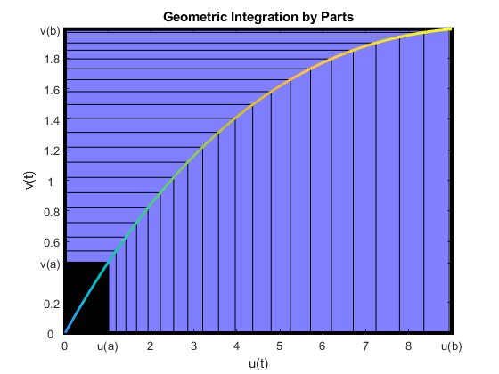
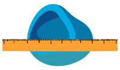
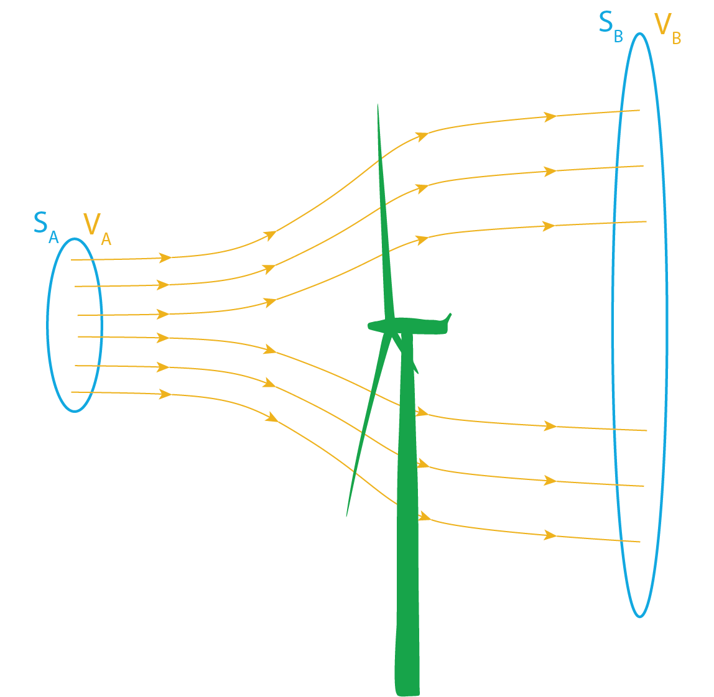
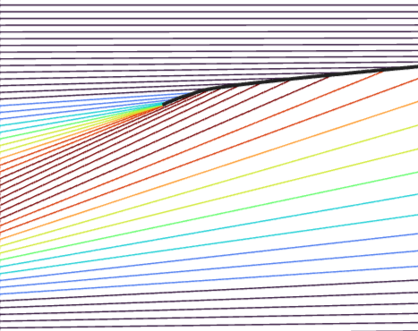

# Multivariable Calculus: Integrals

 or 

**Curriculum Module**

_Created with R2025a. Compatible with R2025a and later releases._

# Information

This curriculum module contains interactive [MATLAB® live scripts](https://www.mathworks.com/products/matlab/live-editor.html) that teach and apply standard concepts in integral multivariable calculus.

## Background

You can use these live scripts as demonstrations in lectures, class activities, or interactive assignments outside class. The first script released in this collection is It also includes examples of computing work and area. 

The instructions inside the live scripts will guide you through the exercises and activities. Get started with each live script by running it one section at a time. To stop running the script or a section midway (for example, when an animation is in progress), use the  Stop button in the **RUN** section of the **Live Editor** tab in the MATLAB Toolstrip.

## Contact Us

Solutions are available upon instructor request. Contact the [MathWorks teaching resources team](mailto:onlineteaching@mathworks.com) if you would like to request solutions, provide feedback, or if you have a question.

## Prerequisites

This module assumes knowledge of single variable calculus and vectors, including vector fields, as covered in the courseware listed here:

| **Courseware Module**    | **Sample content**    | **Available on:**     |
| :-- | :-- | :-- |
| [**Vector Arithmetic**](https://www.mathworks.com/matlabcentral/fileexchange/94555-vector-arithmetic)    |     |        [GitHub](https://github.com/MathWorks-Teaching-Resources/Vector-Arithmetic)      |
| [**Multivariable: Space and Functions**](https://www.mathworks.com/matlabcentral/fileexchange/180356-multivariable-space-and-functions)    |     |       [GitHub](https://github.com/MathWorks-Teaching-Resources/Multivariable-Space-and-Functions)     |
| [**Calculus: Integrals**](https://www.mathworks.com/matlabcentral/fileexchange/105740-calculus-integrals)    |     |        [GitHub](https://github.com/MathWorks-Teaching-Resources/Calculus-Integrals)      |

## Getting Started
### Accessing the Module
### **On MATLAB Online:**

Use the  link to download the module. You will be prompted to log in or create a MathWorks account. The project will be loaded, and you will see an app with several navigation options to get you started.

### **On Desktop:**

Download or clone this repository. Open MATLAB, navigate to the folder containing these scripts and double\-click on [Integrals.prj](<matlab: openProject("Integrals.prj")>). It will add the appropriate files to your MATLAB path and open an app that asks you where you would like to start. 

Ensure you have all the required products ([listed below](#H_E850B4FF)) installed. If you need to include a product, add it using the Add\-On Explorer. To install an add\-on, go to the **Home** tab and select   **Add-Ons** > **Get Add-Ons**. 

## Products

MATLAB® and Symbolic Math Toolbox™ are used throughout, and Statistics and Machine Learning Toolbox™ is used in `AddArrow.m`. 

# Scripts
## **MultipleIntegrals.m** (planned)
||||
| :-- | :-- | :-- |
|     | **In this script, students will...**   $\bullet$ Compute and visualize double and triple integrals   $\bullet$ Use change of variables to simplify and evaluate multiple integrals    | **Academic disciplines**   $\bullet$ Physics   $\bullet$ Mathematics     |

## [**LineIntegrals.m**](Scripts/LineIntegrals.m) 
||||
| :-- | :-- | :-- |
|     | **In this script, students will...**   $\bullet$ Compute line integrals given a path and vector field   $\bullet$ Identify conservative vector fields and use this to compute line integrals   $\bullet$ Apply Green's Theorem to compute area    | **Academic disciplines**   $\bullet$ Electrical Engineering   $\bullet$ Physics   $\bullet$ Mathematics     |

## **SurfaceIntegrals.m** (planned)
||||
| :-- | :-- | :-- |
|     | **In this script, students will...**   $\bullet$ Explore the concepts of control surfaces and control volumes   $\bullet$ Use the divergence theorem    | **Academic disciplines**   $\bullet$ Electrical Engineering   $\bullet$ Physics   $\bullet$ Mathematics     |

# License

The license for this module is available in the [LICENSE.md](https://github.com/MathWorks-Teaching-Resources/Multivariable-Integrals/blob/release/LICENSE.md).

# Related Courseware Modules
| **Courseware Module**    | **Sample Content**    | **Available on:**     |
| :-- | :-- | :-- |
| [**Applied Partial Differential Equations**](https://www.mathworks.com/matlabcentral/fileexchange/172650-applied-partial-differential-equations)    |     |       [GitHub](https://github.com/MathWorks-Teaching-Resources/Applied-PDEs)     |
| [**Multivariable: Space and Functions**](https://www.mathworks.com/matlabcentral/fileexchange/180356-multivariable-space-and-functions)    |     |       [GitHub](https://github.com/MathWorks-Teaching-Resources/Multivariable-Space-and-Functions)     |

Or feel free to explore our other [modular courseware content](https://www.mathworks.com/matlabcentral/profile/authors/37969341).

# Educator Resources
-  [Educator Page](https://www.mathworks.com/academia/educators.html) 

# Contribute 

Looking for more? Find an issue? Have a suggestion? Please contact the [MathWorks teaching resources team](mailto:%20onlineteaching@mathworks.com). If you want to contribute directly to this project, you can find information about how to do so in the [CONTRIBUTING.md](https://github.com/MathWorks-Teaching-Resources/Multivariable-Integrals/blob/release/CONTRIBUTING.md) page on GitHub.

*©* Copyright 2025 The MathWorks, Inc

